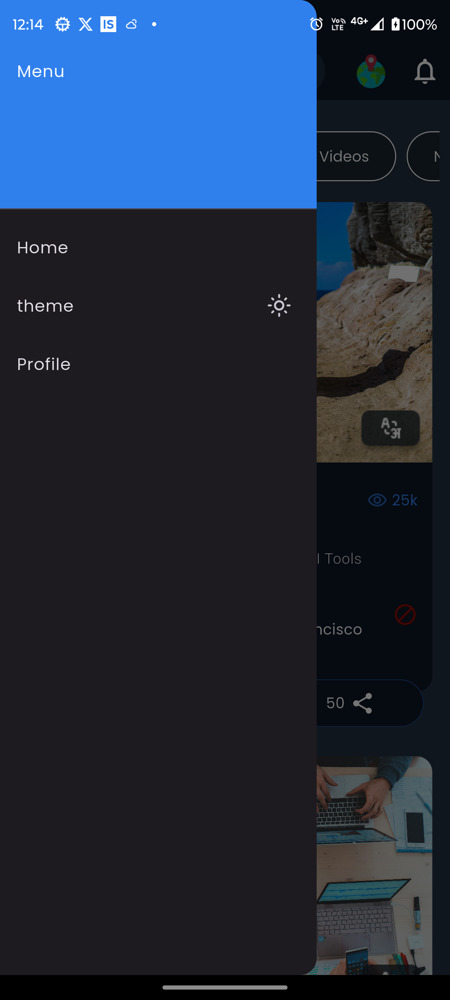
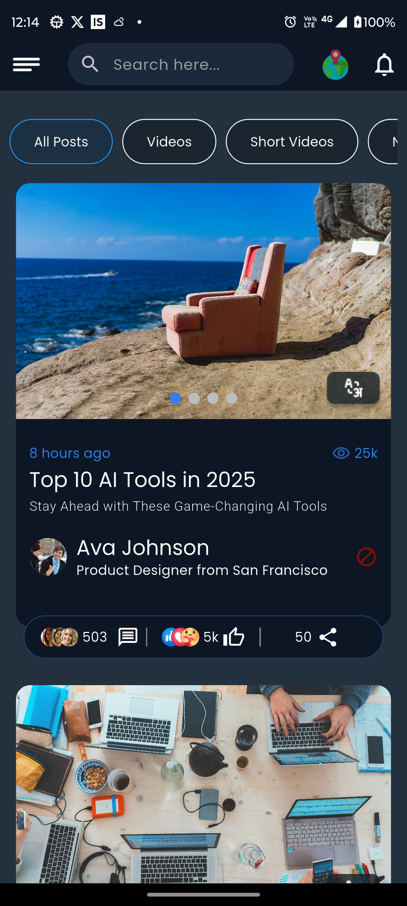
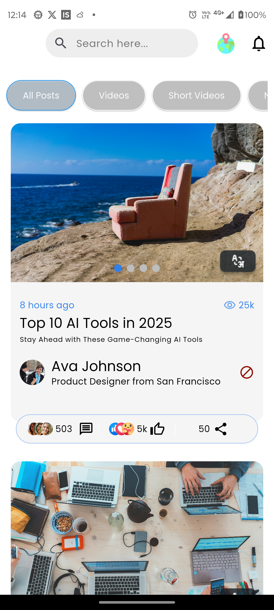
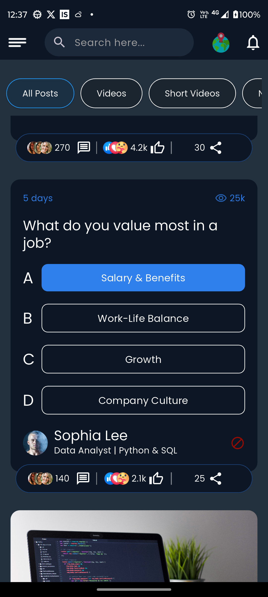

# BlueCs Flutter UI Assignment

A fully featured social feed UI in Flutter built as part of the internship assignment for **BlueCs Limited**. The app simulates a real-world modern feed interface supporting multiple post types (Image, Poll, Shorts), animated loading, and offline-aware state handling.

---


## App Icons

Below are the icons used in the app, located in `assets/icons/image/`:

| drawer.png | home.png | light.png | logo.png | pole.png |
|:----------:|:--------:|:---------:|:--------:|:--------:|
|  |  |  |  |  |

##  Features

-  **Animated splash-to-home transition**
-  **Image posts** with proper layout, text, and likes/comments metadata
-  **Poll (Question) posts** with options and response tracking
-  **Shorts post** section with horizontal scroll and image caching
-  **Live internet connectivity check** using `connectivity_plus`
-  **Light and Dark Theme** support using `ThemeNotifier` and `StateNotifierProvider`
-  **Riverpod State Management** for clean logic separation
-  **Image caching** using `cached_network_image`
-  Organized folder structure for scalable architecture

---

##  Folder Structure

```
lib/
├── controller/           # Riverpod notifiers and providers
├── models/               # Data models (PostModel, Short, Question)
├── core/                # Helpers like network checker or extensions
├── views/
│   ├── screens/          # UI screens like Home, InitialLoad, etc.
│   ├── widgets/          # Post widget types: post, shorts, pole
├── assets/               # Dummy JSON data and image files
```

---

##  Setup Instructions

1. **Clone the repository**
```bash
git clone https://github.com/your-username/bluecs_flutter_assignment.git
cd bluecs_flutter_assignment
```

2. **Install dependencies**
```bash
flutter pub get
```

3. **Run the app**
```bash
flutter run
```

4. **Ensure assets are declared in `pubspec.yaml`**
```yaml
assets:
  - assets/posts.json
  - assets/users.json
  - assets/icons/
```

---

##  Technologies Used

- Flutter 3.x
- Riverpod (StateNotifierProvider)
- Connectivity Plus
- Cached Network Image  
- Google Fonts (Optional)

---

##  Author

**Om Jamnekar**  
Email: omjamnekar877@gmail.com  
[LinkedIn](https://www.linkedin.com/in/omjamnekar) | [GitHub](https://github.com/omjamnekar)

